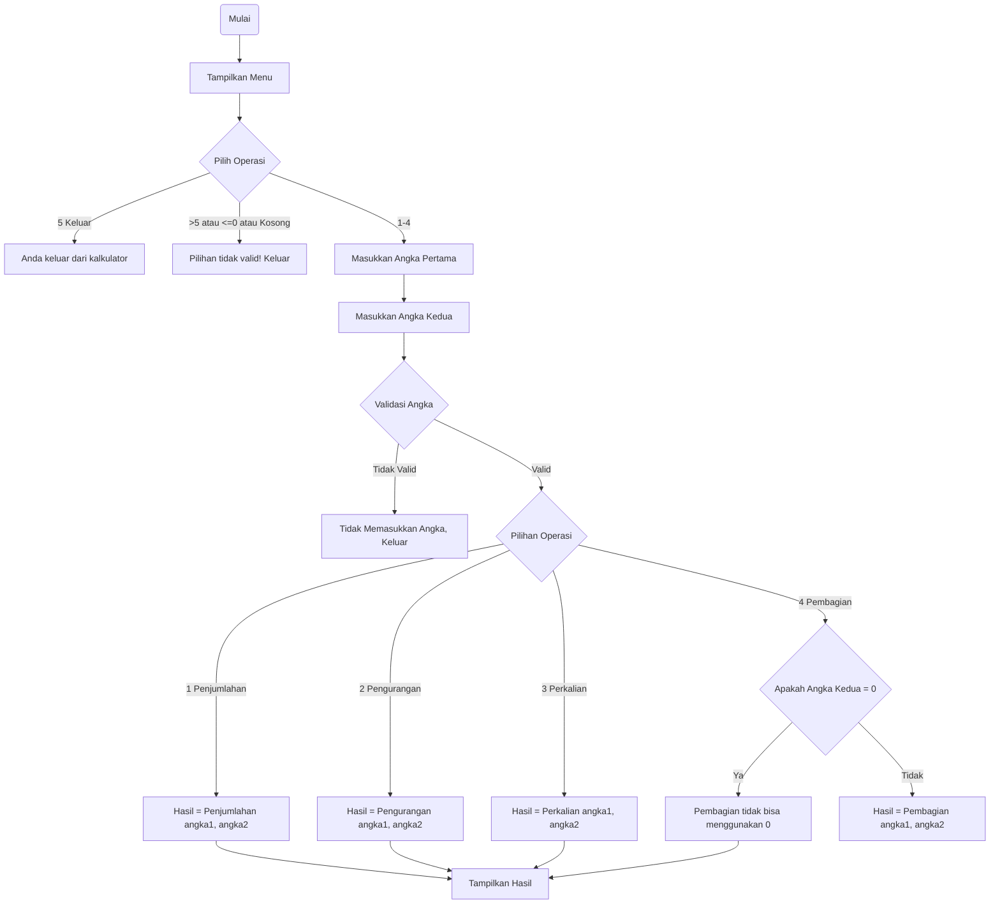

```mermaid
flowchart TD
    A(Mulai) --> B[Tampilkan Menu]
    B --> C{Pilih Operasi}
    
    C -->|5 Keluar| D[Anda keluar dari kalkulator]
    C -->|>5 atau <=0 atau Kosong| E[Pilihan tidak valid! Keluar]
    C -->|1-4| F[Masukkan Angka Pertama]
    F --> G[Masukkan Angka Kedua]
    
    G --> H{Validasi Angka}
    H -->|Tidak Valid| I[Tidak Memasukkan Angka, Keluar]
    H -->|Valid| J{Pilihan Operasi}
    
    J -->|1 Penjumlahan| K[Hasil = Penjumlahan angka1, angka2]
    J -->|2 Pengurangan| L[Hasil = Pengurangan angka1, angka2]
    J -->|3 Perkalian| M[Hasil = Perkalian angka1, angka2]
    J -->|4 Pembagian| N{Apakah Angka Kedua = 0}
    
    N -->|Ya| O[Pembagian tidak bisa menggunakan 0]
    N -->|Tidak| P[Hasil = Pembagian angka1, angka2]
    
    K --> Q[Tampilkan Hasil]
    L --> Q
    M --> Q
    O --> Q
```

